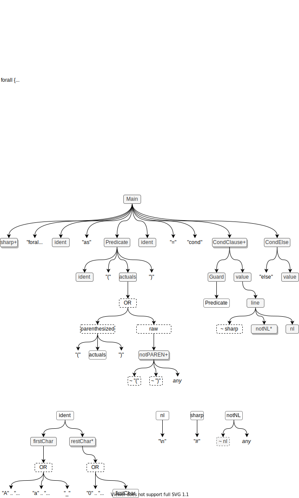

# Elevator Pitch

Source code transpiler that works on blocks of text bracketed by REGEXPs, using PEG to transpile the blocks.

# Goal
Write new version of `Glue` tool that creates a parse tree then walks it down&up.

For now, I will let JavaScript leak through to allow arbitrary code for tree-walking down & up.

Points:
- shows how to write a skin over JavaScript, instead of inventing a completely new DSL
- design by iteration (FDD - Failure Driven Development) 
  - don't assume that I know, yet, what the complete DSL syntax will be
  - let 2nd and 3rd system syndromes "just happen", light weight design makes mistakes acceptable
  - using the tool might generate ideas on what "better" DSL syntax might be, if necessary
  - for example: I used the Glue tool for most of a year without needing huge syntactic changes
  - previous Glue tool experience has shaped my idea of a new DSL syntax
  - relying on another language simplifies this grammar (and lets me cheat)
# Example 1
## Input
```
# layer kind
## parameters
  X
  Kind
## imports
  shapes
  onSameDiagram
  inside
  names
  ports
  contains
## forall X as diagram_fact(cell,X,_)
    Kind = cond
      diagram_fact(kind,X,"ellipse") "ellipse"
      diagram_fact(edge,X,1)         "edge"
      diagram_fact(root,X,1)         "root"
     else                            "rectangle"
## display
  das_fact(kind,${X},${Kind}).

```
## Output (Transpiled)
```
# layer kind
## parameters
  X
  Kind
## imports
  shapes
  onSameDiagram
  inside
  names
  ports
  contains
## query
diagram_fact(cell,X,_) 
(diagram_fact(kind,X,"ellipse")  -> Kind = "ellipse";diagram_fact(edge,X,1)  -> Kind = "edge";diagram_fact(root,X,1)  -> Kind = "root"; Kind = "rectangle")
## display
  das_fact(kind,${X},${Kind}).


```

# Example 2 (JSON)
## Input
```
[
  [
    {
      "children": [],
      "connections": [],
      "id":"cell_11",
      "inputs": ["in" ],
      "name":"world",
      "outputs": [],
      "synccode":"print (&quot;world&quot;)&lt;br&gt;&lt;div&gt;&lt;/div&gt;"
    }
  ],
  [
    {
      "children": ["world", "hello" ],
	"connections":
	[
	    [
		[
		    {"receiver": {"component":"world", "port":"in"}}
		],
		[
		    {"sender": {"component":"hello", "port":"out"}}
		]
	    ]
	],
      "id":"cell_6",
      "inputs": [],
      "name":"helloworld",
      "outputs": ["_" ],
      "synccode":""
    }
  ],
  [
    {
      "children": [],
      "connections": [],
      "id":"cell_7",
      "inputs": ["_"],
      "name":"hello",
      "outputs": ["out"],
      "synccode":"print (&quot;hello&quot;)&lt;br&gt;self.send (&quot;out&quot;, True)&lt;br&gt;&lt;div&gt;&lt;/div&gt;"
    }
  ]
]
```
## Output 
same as input


# AST vs CST
## AST
   - "Abstract" Syntax Tree
   - what is possible
## CST
   - "Concrete" Syntax Tree
   - what is actually there
# Parser - Forall DSL
```
forall {
  Main = sharp+ "forall" ident "as" Predicate ident "=" "cond" CondClause+ CondElse

  Predicate = ident "(" actuals ")"
  CondClause = Guard value
  CondElse = "else" value

  Guard = Predicate
  value = line

  actuals =   "(" actuals ")" -- parenthesized
            | notPAREN+         -- raw

  line = ~sharp notNL* nl

  notPAREN = ~"(" ~")" any

    ident = firstChar restChar*
    firstChar = "A" .. "Z" | "a" .. "z" | "_"
    restChar = "0" .. "9" | firstChar
    nl = "\n"
    sharp = "#"
    notNL = ~nl any
}
```


## Diagram of AST



# DSL Preprocessing a DSL
